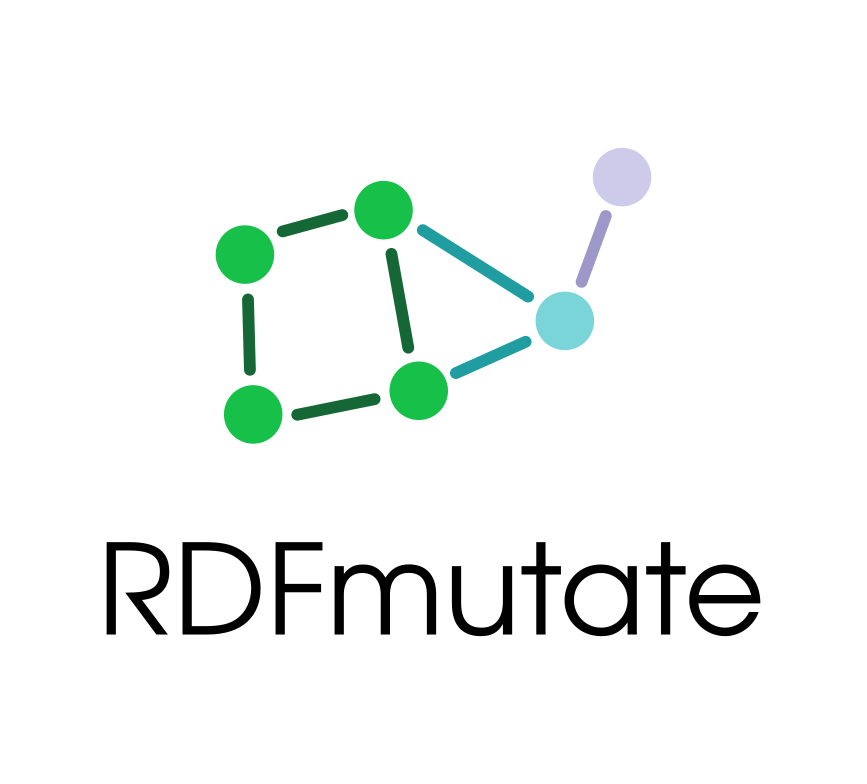

  

# RDFmutate

A tool for mutation of RDF knowledge graphs, and in particular OWL ontologies, with respect to constraints. 

You can find the documentation for users and developers in the  [wiki](https://github.com/Edkamb/OntoMutate/wiki).

## Installation
For all options on how to set up our tool, please have a look at the corresponding [wiki page](https://github.com/Edkamb/OntoMutate/wiki/Installation).

## Evaluation for ISSRE 2024 Publication
 - The reviewed artifact is available on [Zenodo](https://doi.org/10.5281/zenodo.13325715)
 - You can also consult the branch [issre](https://github.com/Edkamb/OntoMutate/tree/issre) to find the data used for the evaluation and detailed explanations how to reproduce our results.
